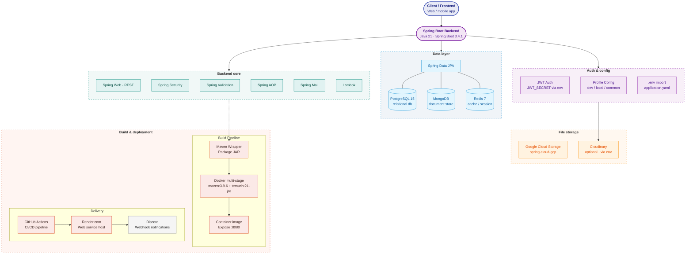

<div align="center">
<a href="https://github.com/Sumonta056/FixHub-Issue-Tracker-Website" target="blank">


</a>

<h1> 69chan </h1>

**“Where Otaku hearts connect — 絆 (Kizuna) through anime.”**

***69chan*** is a social media app for Otakus.  
You can post what you love, chat with other fans, and find people who like the same anime and manga.  

Our goal is simple: make a fun and friendly place where Otakus can connect and enjoy anime culture together. With helping hands from


</div>

## ✨ Features
- **🔐 Authentication:** Secure ***JWT-based*** with ***HS256 Algorithm*** and token refreshing mechanism access levels and ***Attribute-based Access Control*** ensure that only authorized users can manage or view resources.
- **♾️ Infinite Scrolling:** Making users's home feeds looks like never ends with ***cursor-based pagination*** and ***fan-out on write/read*** pattern.
- **☁️ Media Storage:** Managed to handle bulk media file uploading from users up to ***10 files, 1KB-10MB***, at once with latency ***2-4s*** with asynchronous thread executors.
  
  
- **🔍 Advanced Searching:** Power searching utizling Full Text Search of Postgres and MongoDB to quickly find out posts and user accounts.
- **📝 Communication:** Real-time chat pipeline built with ***Websocket + STOMP*** with helping of message queue from ***Redis*** gives users who finds their same interests to connect each other.  .
- **📱 Multiplatform:** Access ***69chan*** on any device from *web or mobile* with a responsive design that adapts to various screen sizes.


## 🛠 Tech Stack


## 🏗 Project Architecture

### Package Structure
```
com.congty9a4.backend/
├── annotation/          # Custom annotations (@TrackExecutionTime)
├── config/             # Configuration classes
│   ├── security/       # JWT, CORS, filters
│   ├── cloud/          # GCS configuration
│   └── mongodb/        # MongoDB setup
├── controller/         # REST API endpoints
├── dto/               # Request/Response DTOs
├── entity/            # JPA entities & MongoDB documents
├── exception/         # Custom exceptions & error handling
├── mapper/            # MapStruct mappers
├── repository/        # Data access layer
├── service/           # Business logic
│   ├── implement/     # Service implementations
│   ├── storage/       # File storage services
│   └── crawling/      # Reddit data crawling
└── util/              # Utility classes
```

### Key Design Patterns
- **Polyglot Persistence**: PostgreSQL for users/relationships, MongoDB for posts/comments
- **JWT Stateless Authentication**: Token-based auth with refresh tokens
- **DTO Pattern**: Separation of internal entities and API contracts
- **Service Layer**: Business logic isolation from controllers
- **AOP**: Logging and execution time tracking

## 💾 Database Design

### PostgreSQL (Relational Data)
**Tables:**
- `userchans` - User accounts with credentials
- `profiles` - Extended user information (bio, avatar, etc.)
- `friendships` - Friend requests/connections (PENDING, ACCEPTED, BLOCKED)
- `relationships` - User relationships

**Features:**
- UUID primary keys for users
- Full-Text Search (FTS) with GIN indexes
- Email uniqueness constraints
- Automatic timestamps (created_at, updated_at)

### MongoDB (Document Storage)
**Collections:**
- `posts` - User posts with media, tags, likes
- `comments` - Nested comments with parent-child relationships

**Indexes:**
- Text indexes on post captions for search
- User ID indexes for efficient queries

## 🚀 Getting Started

### Prerequisites
- **JDK 21** - `java -version` to verify
- **Docker** (optional) - for containerized databases
- **PostgreSQL** - Running instance
- **MongoDB** - Running instance

### Environment Setup

1. **Create `.env` file** in project root:
```bash
# Database
POSTGRE_DB_HOST=localhost
POSTGRE_DB_PORT=5432
POSTGRE_DB_USERNAME=your_user
POSTGRE_DB_PASSWORD=your_password

MONGO_DB_HOST=your_mongo_host
MONGO_DB_NAME=69chan
MONGO_DB_USERNAME=your_mongo_user
MONGO_DB_PASSWORD=your_mongo_pass

# JWT
JWT_SECRET=your_super_secret_key_min_256_bits

# Storage (choose one)
STORAGE_PROVIDER=gcs  # or cloudinary

# GCS (if using)
GOOGLE_APPLICATION_CREDENTIALS=path/to/gcs_credentials.json

# Cloudinary (if using)
CLOUDINARY_CLOUD_NAME=your_cloud
CLOUDINARY_API_KEY=your_key
CLOUDINARY_API_SECRET=your_secret

# Swagger
SWAGGER_SERVER_URL=http://localhost:8080
```

2. **Build the project:**
```bash
./mvnw clean install
```

3. **Run locally:**
```bash
./mvnw spring-boot:run -Dspring-boot.run.profiles=local
```

4. **Access the app:**
- API: `http://localhost:8080`
- Swagger UI: `http://localhost:8080/swagger-ui.html`

### Running Tests
```bash
./mvnw test
```

### Profiles
- `local` - Local development
- `dev` - Development environment
- `common` - Shared configuration

## 🐳 Deployment

### Docker Build
```bash
docker build -t 69chan-backend .
```

### Docker Compose
```bash
docker-compose up -d
```

**Dockerfile stages:**
1. Maven build with dependency caching
2. Lightweight JRE runtime (Alpine)
3. Exposes port 8080

## 🔮 Future Roadmap

### High Priority
- [ ] **Cursor-based Pagination** - Replace offset pagination for feed (noted in PostController)
- [ ] **Real-time Features** - WebSocket support for notifications
- [ ] **Email Verification** - Complete email service integration
- [ ] **Password Reset** - Forgot password flow
- [ ] **Role-based Access Control** - Admin/Moderator roles
- [ ] **Post Privacy** - Public/Friends/Private visibility (enum exists, not enforced)

### Medium Priority
- [ ] **Media Processing** - Image resizing, video transcoding
- [ ] **Search Improvements** - Elasticsearch integration, autocomplete
- [ ] **Caching Layer** - Redis for sessions, feed caching
- [ ] **Rate Limiting** - API throttling
- [ ] **Comprehensive Testing** - Increase test coverage
- [ ] **Database Migrations** - Complete Flyway migration scripts

### Low Priority
- [ ] **GraphQL API** - Alternative to REST
- [ ] **Metrics & Monitoring** - Prometheus/Grafana integration
- [ ] **Multi-language Support** - i18n
- [ ] **Bot Detection** - CAPTCHA integration


