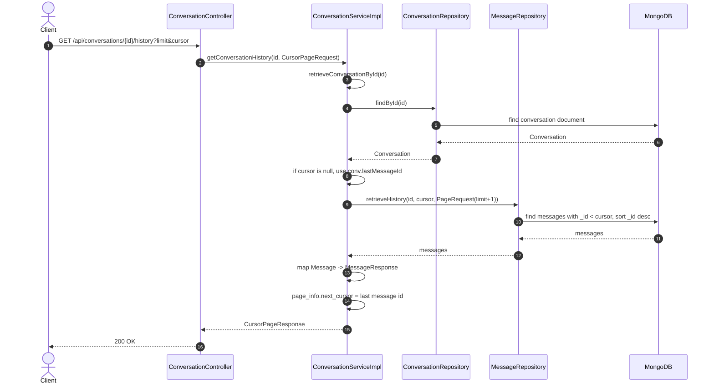

# [SPEC] Chat Conversations and History

→ Retrieve conversation list, conversation detail, and message history with cursor pagination.

## Feature requirements

- Users can list their conversations.
- Users can view conversation detail by ID.
- Users can fetch conversation history with cursor-based pagination.

## Problem

Chat screens need fast access to the conversation list and message history. Fetching large histories without pagination is slow and expensive. The conversation list also must be filtered to only include conversations the current user participates in.

## Solution

We expose three REST endpoints backed by MongoDB queries:

1. **Conversation list**: Filter conversations by `participant_ids` and sort by `last_message_time` descending.
2. **Conversation detail**: Fetch a single conversation document by ID.
3. **Conversation history**: Fetch messages in descending `_id` order with cursor-based pagination.

## Feature’s Diagram



## Endpoint

### GET /api/conversations/me

- **Description**: List conversations where the current user is a participant, sorted by `last_message_time` descending.
- **Response**: `ApiResponse<List<ConversationResponse>>`

**Success Response (200 OK)**:
```json
{
  "isSuccess": true,
  "body": [
    {
      "id": "conv_123",
      "participant_ids": ["user_a", "user_b"],
      "last_message": "hello",
      "last_sender_id": "user_a",
      "last_message_time": 1713353532000,
      "unread_count": 2
    }
  ],
  "timestamp": "2026-04-20T10:00:00Z"
}
```

**Errors**:
- `401 UNAUTHORIZED`: `UNAUTHENTICATED`, `INVALID_TOKEN`, `EXPIRED_TOKEN`

**Error Response (401 Unauthorized)**:
```json
{
  "isSuccess": false,
  "status": 40101,
  "message": "Invalid or expired token. Please log in again.",
  "detail": "JWT is invalid or missing.",
  "timestamp": "2026-04-20T10:00:00Z"
}
```

**Implementation notes**:
- `ConversationRepository.findAllMyChats(userId)` uses MongoDB filter `{ 'participant_ids': ?0 }` and sort `{ 'last_message_time': -1 }`.

### GET /api/conversations/{id}

- **Description**: Retrieve a conversation by ID.
- **Response**: `ApiResponse<ConversationResponse>`

**Success Response (200 OK)**:
```json
{
  "isSuccess": true,
  "body": {
    "id": "conv_123",
    "participant_ids": ["user_a", "user_b"],
    "last_message": "hello",
    "last_sender_id": "user_a",
    "last_message_time": 1713353532000,
    "unread_count": 2
  },
  "timestamp": "2026-04-20T10:00:00Z"
}
```

**Errors**:
- `400 BAD_REQUEST`: `CONVERSATION_NOT_FOUND`, `CANNOT_ACCESS_CONVERSATION`
- `401 UNAUTHORIZED`: `UNAUTHENTICATED`, `INVALID_TOKEN`, `EXPIRED_TOKEN`

**Error Response (400 Bad Request)**:
```json
{
  "isSuccess": false,
  "status": 40074,
  "message": "The conversation you are looking for could not be found.",
  "detail": "Conversation conv_123 not found",
  "timestamp": "2026-04-20T10:00:00Z"
}
```

### GET /api/conversations/{id}/history?limit=10&cursor=12345

- **Description**: Retrieve message history for a conversation using cursor pagination by message ID.
- **Query Parameters**:
  - `limit` (optional, int, default=10)
  - `cursor` (optional, long). If omitted, the server uses the conversation's `last_message_id`.
- **Response**: `CursorPageResponse<MessageResponse>`

**Success Response (200 OK)**:
```json
{
  "data": [
    {
      "id": 321,
      "sender_id": "user_a",
      "receiver_id": "user_b",
      "content": "hello",
      "created_at": "2026-04-20T10:00:00Z"
    }
  ],
  "page_info": {
    "next_cursor": 320,
    "has_next": false
  }
}
```

**Errors**:
- `400 BAD_REQUEST`: `CONVERSATION_NOT_FOUND`, `CANNOT_ACCESS_CONVERSATION`
- `401 UNAUTHORIZED`: `UNAUTHENTICATED`, `INVALID_TOKEN`, `EXPIRED_TOKEN`

**Error Response (400 Bad Request)**:
```json
{
  "isSuccess": false,
  "status": 40073,
  "message": "You do not have permission to access this conversation.",
  "detail": "User user_a cannot access conv_123",
  "timestamp": "2026-04-20T10:00:00Z"
}
```

**Pagination behavior**:
- The service first loads the conversation by ID. If not found, it throws `ErrorCode.CONVERSATION_NOT_FOUND`.
- If `cursor` is omitted, the service uses `conversation.last_message_id` as the starting cursor.
- Query: `MessageRepository.retrieveHistory(conversationId, cursor, PageRequest.of(0, limit + 1))`.
- MongoDB filter `{ 'conversation_id': ?0, '_id': { $lt: ?1 } }` and sort `{ '_id': -1 }`.
- `page_info.next_cursor` is set to the last message ID in the returned list.
- `page_info.has_next` is not set by the current implementation and defaults to `false`.

## Data model reference

### Conversation
Source: `src/main/java/com/congty9a4/backend/entity/Conversation.java`
- `id` (string)
- `participant_ids` (list of string)
- `last_message` (string)
- `last_message_id` (long)
- `last_sender_id` (string)
- `last_message_time` (long)
- `unread_count` (int)

### Message
Source: `src/main/java/com/congty9a4/backend/entity/Message.java`
- `id` (long)
- `sender_id` (string)
- `receiver_id` (string)
- `content` (string)
- `conversation_id` (document reference)
- `created_at` (OffsetDateTime)

### MessageResponse
Source: `src/main/java/com/congty9a4/backend/dto/resp/MessageResponse.java`
- `id` (long)
- `senderId` (string)
- `receiverId` (string)
- `content` (string)
- `createdAt` (OffsetDateTime)

### ApiResponse
Source: `src/main/java/com/congty9a4/backend/dto/resp/api/ApiResponse.java`
- `isSuccess` (boolean, default true)
- `body` (payload)
- `timestamp` (OffsetDateTime)

### ErrorApiResponse
Source: `src/main/java/com/congty9a4/backend/dto/resp/api/ErrorApiResponse.java`
- `isSuccess` (boolean, default false)
- `status` (int, application error code)
- `message` (string)
- `detail` (string)
- `errors` (map)
- `timestamp` (OffsetDateTime)

# Changelog
- 2026-04-21: Added error responses and aligned response bodies with controller DTOs.
- 2026-04-21: Replaced ASCII diagram with Mermaid and expanded history flow details.
- 2026-04-20: Updated to match feature-spec template and current controllers.
