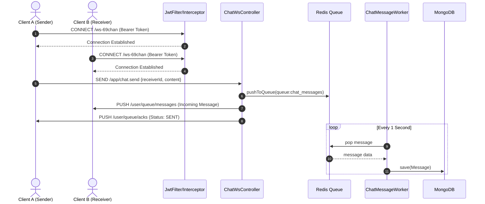

# [SPEC] Real-time Chat (WebSocket & STOMP)

→ Quản lý luồng kết nối, gửi/nhận tin nhắn theo thời gian thực (Real-time) sử dụng giao thức WebSocket kết hợp STOMP và Redis Message Queue.

## 1. Feature requirements

- Hỗ trợ kết nối bảo mật qua WebSocket bằng JWT Token.
- Gửi và nhận tin nhắn 1-1 theo thời gian thực (độ trễ thấp).
- Có cơ chế xác nhận trạng thái (ACK) cho người gửi khi tin nhắn đã được hệ thống tiếp nhận.
- Đảm bảo hiệu năng hệ thống bằng cách đẩy tin nhắn vào hàng đợi (Redis Queue) để xử lý bất đồng bộ, không lưu trực tiếp vào DB trên luồng chat.

## 2. Architecture Diagram

Sơ đồ dưới đây mô tả luồng dữ liệu khi User A gửi tin nhắn cho User B:

## 3. Connection & Authentication

Endpoint: ws://<domain>/ws-69chan

Protocol: STOMP over WebSocket / SockJS

Authentication: Bắt buộc truyền Access Token qua Header khi thực hiện lệnh CONNECT.

    JSON
    {
        "Authorization": "Bearer <access_token>"
    }

Lưu ý: Kết nối sẽ bị từ chối (Ngắt lập tức) nếu token hết hạn, sai định dạng, hoặc nằm trong Blacklist của Redis.

## 4. Gửi tin nhắn (Publish)

Client sử dụng STOMP client để bắn gói tin lên Server.

Destination: /app/chat.send

Payload Format:

JSON
{
"receiverId": "string (ID của người nhận)",
"content": "string (Nội dung tin nhắn)",
"type": "TEXT"
}

## 5. Lắng nghe sự kiện (Subscribe Channels)

Sau khi kết nối thành công, Client CẦN subscribe vào các đường dẫn (queues) sau để nhận dữ liệu đẩy từ Server về.

### 5.1. Kênh nhận tin nhắn đến (Incoming Messages)

Topic: /user/queue/messages

Decription: Nơi nhận các tin nhắn do người khác gửi đến current user.

Payload nhận được (MessageResponse):

JSON
{
"id": "123456789",
"senderId": "user_a_id",
"receiverId": "my_user_id",
"content": "Alo, nghe rõ trả lời!",
"createdAt": "2026-04-20T10:00:00Z"
}

### 5.2. Kênh nhận trạng thái gửi (Message Acknowledgement)

Topic: /user/queue/acks

Decription: Server phản hồi lại cho người gửi biết tin nhắn đã được hệ thống tiếp nhận và đưa vào Queue thành công. Dùng để Frontend đổi trạng thái tin nhắn từ "Đang gửi" sang "Đã gửi".

Payload nhận được (WsAckMessage):

JSON
{
"messageId": "d64f8a59-0de0-4714-bd35-0ef804943de5",
"status": "SENT"
}

## 6. Implementation Notes & Technical Flow

Security Bypass: Endpoint /ws-69chan được loại trừ khỏi HTTP JwtFilter nhưng được kiểm tra nghiêm ngặt tại ChannelInterceptor (bước Handshake của STOMP).

Message Broker: Cấu hình SimpleBroker với prefix /queue để hỗ trợ cơ chế định tuyến (routing) tin nhắn 1-1 qua hàm convertAndSendToUser.

Queue Mechanism: Việc lưu trữ DB được tách rời hoàn toàn khỏi luồng WebSocket. Nếu MongoDB có dấu hiệu chậm lại, luồng chat của người dùng vẫn đảm bảo độ trễ gần như bằng 0 (zero-latency) nhờ bộ đệm Redis.
